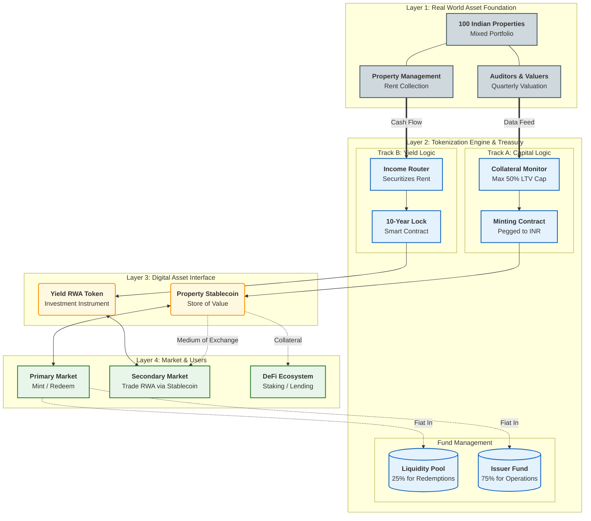

# Business Model Overview: Dual-Track Indian Real Estate Tokenization

### Executive Summary
This project introduces a hybrid Real World Asset (RWA) ecosystem backed by a portfolio of **100 high-value properties in India**. By implementing a **Dual-Track Tokenomics** structure, we separate the underlying asset value from the generated cash flow. This allows us to simultaneously issue an **Asset-Backed Stablecoin** (providing liquidity and capital efficiency) and a **Yield-Bearing RWA Token** (providing investment returns), creating a self-sustaining financial loop.

---

---

### 1. The Core Asset Foundation
* **Underlying Assets:** A diversified portfolio of 100 distinct real estate properties located in India.
* **Composition:** The portfolio includes both **Rental Properties** (generating active cash flow) and **Self-Use Properties** (holding intrinsic capital value).
* **Role:** These physical assets serve as the unified collateral base for the entire on-chain ecosystem.

---

### 2. Track One: The Capital Layer (Property Stablecoin)
*Objective: To unlock the trapped equity in real estate and provide a stable medium of exchange.*

* **Product:** **Property Stablecoin** (Pegged 1:1 to the **Indian Rupee - INR**).
* **Issuance Mechanism:** The stablecoin is minted against the aggregate valuation of the entire 100-property portfolio.
* **Risk Management (LTV):** Issuance is capped at a strict **50% Loan-to-Value (LTV)** ratio. This over-collateralization ensures that the stablecoin remains fully backed even during market fluctuations.
* **Valuation & Audits:** The property portfolio undergoes **quarterly independent valuations**. If asset values fluctuate, the supply is adjusted to ensure collateral assets always exceed the stablecoin market cap.
* **Liquidity Reserve:** Upon issuance, **25% of the proceeds** are locked in a dedicated **INR Liquidity Pool**. This ensures immediate liquidity is available for investors wishing to redeem their stablecoins.
* **Issuer Capital:** The remaining **75% of proceeds** are utilized by the issuer for business expansion, property acquisition, or operational costs.

---

### 3. Track Two: The Yield Layer (RWA Income Token)
*Objective: To securitize future cash flows and offer investors direct exposure to real estate dividends.*

* **Product:** **10-Year Property Yield RWA Token**.
* **Backing:** This token is backed exclusively by the **rental income streams** generated by the tenanted properties within the portfolio.
* **Value Proposition:** Holders are entitled to a share of the rental profits for a fixed 10-year period.
* **Market Pricing:** Unlike the stablecoin, the price of the RWA Token is **floating**. It is determined by supply and demand in the secondary market, reflecting the market's sentiment on Indian real estate yields.

---

### 4. The Ecosystem Loop & Market Dynamics
The two tracks are integrated to create a closed-loop economy:

* **Primary Market (Onboarding):** Investors enter by exchanging Fiat or Crypto for the **Property Stablecoin**.
* **Secondary Market Utility:** The **Property Stablecoin** acts as the exclusive **medium of exchange** for trading the **RWA Yield Token**.
    * *Effect:* This creates utility-driven demand for the stablecoin. Investors who want to buy the high-yield RWA token must first acquire and hold the stablecoin.
* **DeFi Integration:**
    * **Staking:** Investors can stake their stablecoins to earn passive rewards (funded by the issuer's operational profits).
    * **Leverage:** Advanced users can utilize lending protocols to borrow against their RWA tokens or leverage their position.

### 5. Summary of Strategic Advantages
1.  **Capital Efficiency:** The issuer unlocks 75% of the portfolio's equity value without selling the properties.
2.  **Trust & Stability:** The 50% LTV and quarterly re-valuation provide a high safety margin for stablecoin holders.
3.  **Liquidity:** The 25% redemption pool mitigates the "illiquidity risk" typically associated with real estate.
4.  **Demand Driver:** Forcing RWA trades to be settled in the Property Stablecoin ensures constant volume and demand for the stablecoin.

---